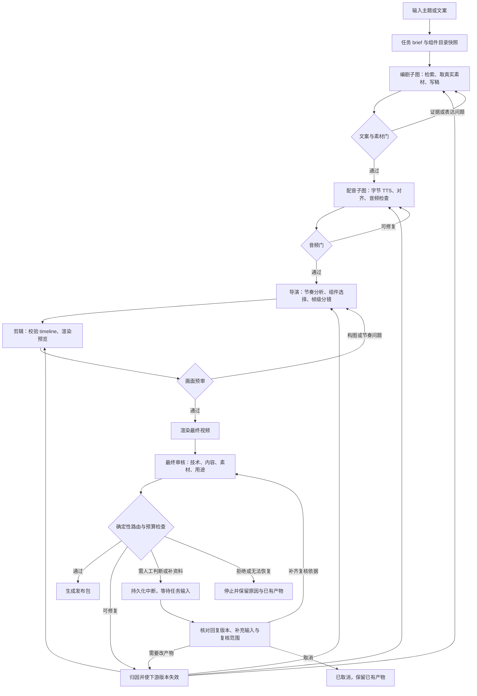
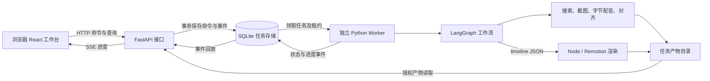

# VideoAgents：基于 LangGraph 的短视频制作工作流方案

日期：2026-10-03。这是实施前通过审查的设计记录，保留当时的源码和外部资料核验结论。当前实现、实际测试及边界见 [实现与验证记录](videoagents-implementation-status.md)，启动操作见 [使用说明](videoagents-setup.md)。设计中的未来扩展不能当作已实测功能。

最新实现已将素材独立为第一个节点：`materials → screenwriter`，并增加文案审查讨论。历史方案中的编剧采集职责已迁入素材节点；当前交接与平台能力见 [素材研究节点](videoagents-materials.md)。2026-10-06 已将全部 152 个社区组件以固定视觉预设接入生产 Timeline，并加入真实视频适配器，与 9 个参数化适配器组成 161 个生产 ID；当前事实以 [实现与验证记录](videoagents-implementation-status.md) 为准。

## 1. 目标与设计决定

沿用用户的五个岗位：**编剧 → 配音 → 导演 → 剪辑 → 审核**。使用 Python LangGraph 管理交接、状态、返工和恢复，继续使用当前 TypeScript/Remotion 项目负责画面渲染。

每个岗位交付可以检查的文件和结构化数据。编剧交付“文案 + 事实证据 + 真实素材”；配音交付“音频 + 实际时间戳”；导演交付“带帧区间的分镜”；剪辑交付“成片 + 渲染记录”；审核交付“问题定位 + 放行状态”。

首版落在 `D:\remotion_video`，交付范围包含完整 Web 前端、后端 API、独立后台执行进程、LangGraph 工作流及 Remotion 渲染。新增 `web/` 操作台、`server/` API、`worker/` 执行进程和独立的 `videoagents/` Python 包，通过 JSON 和子进程调用现有 Remotion。借鉴同级 `D:\TradingAgents-astock` 的代码组织和状态交接，不引入股票分析业务依赖。

首版默认竖屏 1080×1920、30fps；平台、目标时长、受众、商业/非商业用途是每条任务的 brief 字段，可覆盖默认。时长未指定时可用 60 秒制作草案，但最终以实测音频和 brief 容差验收。平台和用途未明确时可完成预览，最终状态不能直接进入发布就绪。

主要交付：`final.mp4`、`cover.png`、`captions.srt`、文案、素材证据清单、分镜、审核报告和可恢复任务记录。首版终点是“内部审核后可交付的发布包”，上传发布作为将来独立能力。

## 2. 已核验现状与可借鉴部分

### 2.1 TradingAgents-Astock

| 源码事实 | 视频系统如何借鉴 |
|---|---|
| 构造 `TradingAgentsGraph` 后调用 `propagate()` 执行。[入口](D:/TradingAgents-astock/main.py:31) | `VideoProductionGraph` 装配图，`produce(brief)` 创建并运行一个视频任务 |
| `GraphSetup` 注册节点和边，随后 `compile()`。[构建](D:/TradingAgents-astock/tradingagents/graph/setup.py:130)、[装配](D:/TradingAgents-astock/tradingagents/graph/trading_graph.py:330) | `StateGraph(VideoState)` 组织五个阶段和真实质量门 |
| `AgentState` 保存报告；节点返回增量，下一角色直接读取。[State](D:/TradingAgents-astock/tradingagents/agents/utils/agent_states.py:46)、[返回报告](D:/TradingAgents-astock/tradingagents/agents/analysts/market_analyst.py:96)、[读取报告](D:/TradingAgents-astock/tradingagents/agents/researchers/bull_researcher.py:12) | 各角色读写 `script_ref/audio_ref/storyboard_ref/render_ref/review_ref`，无需互相发送自然语言消息 |
| `create_market_analyst(llm)` 是注入模型的角色工厂。[工厂](D:/TradingAgents-astock/tradingagents/agents/analysts/market_analyst.py:11) | 编剧、导演、审核采用独立角色工厂；模型、提示词和允许工具分别配置 |
| 条件边控制工具循环和辩论次数。[条件边](D:/TradingAgents-astock/tradingagents/graph/conditional_logic.py:14) | 对检索、改稿、重新配音、重新分镜设置独立次数和成本上限 |
| Quality Gate 仅输出质量摘要，后面无条件进入 Bull Researcher。[质量结果](D:/TradingAgents-astock/tradingagents/agents/quality_gate.py:158)、[无条件边](D:/TradingAgents-astock/tradingagents/graph/setup.py:177) | 必须新增结构化 PASS/REVISE/NEEDS_HUMAN/REJECT 及条件边，不能照搬为自动阻断门 |
| 已有 SQLite checkpoint，但默认关闭；成功后清除。[配置](D:/TradingAgents-astock/tradingagents/default_config.py:88)、[checkpoint](D:/TradingAgents-astock/tradingagents/graph/checkpointer.py:19)、[清除](D:/TradingAgents-astock/tradingagents/graph/trading_graph.py:800) | 视频从首版启用持久化；保留版本证据和外部任务台账，不用股票代码+日期作为任务身份 |

2026-10-03 只读核验邻仓虚拟环境：LangGraph 1.2.12、langgraph-checkpoint-sqlite 3.1.1。视频项目仍需独立锁定并验证 Python 依赖；不把邻仓虚拟环境当作本项目部署结果。

### 2.2 当前 Remotion 与飞书表

本节保留下述 2026-10-03 实施前核验。当前 [package.json](D:/remotion_video/package.json:1) 仍锁定 Remotion 4.0.532，但已新增面向任意冻结 Timeline 的 `VideoFromTimeline` 生产入口，并接入字节配音与导入音频路径；不要把下表的历史缺口当作当前实现状态。

| 已有能力 | 当前证据与适配边界 |
|---|---|
| JSON 驱动主片 metadata | [Root.tsx](D:/remotion_video/src/Root.tsx:8) 已接 props 和 calculateMetadata；[AiScienceVideo.tsx](D:/remotion_video/src/templates/AiScienceVideo.tsx:160) 仅映射八类固定场景 |
| 实际音频与逐词时间戳 | [prepare_episode.py](D:/remotion_video/scripts/prepare_episode.py:39) 已有缓存、WordBoundary、ffprobe 和临时文件提交；输入仍固定第一期，未实现独立对齐器 |
| 中文时间字幕 | [captionPages.ts](D:/remotion_video/src/components/captionPages.ts:5)、[TimedCaptions.tsx](D:/remotion_video/src/components/TimedCaptions.tsx:7) 可借用分页和词级强调；[检查脚本](D:/remotion_video/scripts/check-captions.mjs:5) 有第一期专属假设，需参数化 |
| 152 对横竖组件入口 | 实施前解析得到 152 对、横竖 entries 各 152；当前已生成统一生产清单并作为固定 preset 接入，由 9 个 adapter 提供类型化内容 props |
| 基础验证 | [validate_episode.py](D:/remotion_video/scripts/validate_episode.py:30) 仅在视频已存在时检查 MP4；[verify-community.mjs](D:/remotion_video/scripts/verify-community.mjs:40) 是组件三帧抽样，均不能直接作为最终发布门 |

已实时读取[用户提供的飞书组件表](https://icnpfyu4nynj.feishu.cn/sheets/UPpgsQJnLhgA0WtzlU2crIXqnOe)，revision 113。读取了工作簿结构、组件表头和首尾样本、使用说明；未做全表逐单元格校验。当前五列是：组件名称、竖版路径、横版路径、适合表达的内容、适用场景。使用说明列出 152 个组件及其用途边界。

本地对应 [component-paths.json](D:/remotion_video/docs/component-paths.json:1) 和 [component-use-guide.json](D:/remotion_video/docs/component-use-guide.json:1)。它们现在通过 `scripts/build-production-component-manifest.mjs` 生成统一清单，由导演、后端、前端和渲染器共同使用；组件仍有两种不同能力边界：

- 152 个 `Component/demo/meta` 已能作为固定视觉 preset 执行，但沿用示例参数，不等于支持统一文案、素材和时长参数。[组件文档](D:/remotion_video/docs/component-library.md:42)
- 部分原卡没有暴露文案与布局 props，不能直接把演示内容当成真实论据。[原卡说明](D:/remotion_video/docs/component-library.md:96)
- 108 张 Talkcraft 卡的本地导入记录是非商业个人用途，原许可保留。它们仅进入 personal/unspecified 清单，商业任务的导演 schema、后端校验和前端选择器会排除这些 ID。[导入记录](D:/remotion_video/licenses/community/video-talkcraft/IMPORT.md:7)、[原许可声明](D:/remotion_video/licenses/community/video-talkcraft/LICENSE:5)
- 代码许可、字体许可、图片/视频/音乐许可分别记录。原作者 demo 主持人、聊天内容和图表数字不作为生产素材或事实证据。[素材记录](D:/remotion_video/licenses/community/video-talkcraft/assets-README.md:12)

## 3. LangGraph 总体流程



图中 R 的四条线表示**择一归因路由**，不是四个阶段同时执行。所有质量门共享“可修复、需人工、拒绝、预算耗尽”处理；图仅简化展示主路径。网络/工具异常走单独的运行错误路径，不包装成内容审核通过。

在代码中区分三种节点：

1. **模型决策节点**：研究规划、写稿、分镜、内容/视觉审核。
2. **确定性工具节点**：搜索接口、截图、下载、TTS、对齐、ffprobe、timeline 编译、Remotion、文件校验。
3. **确定性路由节点**：校验 schema、检查严重问题、比较版本、检查预算，决定下一节点。路由权不交给任意文本输出。

可并行的部分限制在小型子图：独立来源检索、独立素材准备、固定三路最终审核。配音必须等文案版本冻结；导演必须等音频与对齐通过；剪辑必须等分镜通过。

## 4. 五个岗位的输入、输出和验收

| 岗位 | 输入 | 交付物 | 阶段门 |
|---|---|---|---|
| 编剧 | 用户主题/稿件、受众、平台、时长、资料 | `research.json`、`script.json`、`script.md`、`assets.json` 与真实素材文件 | 每条事实性主张有来源或明确标注为推断；关键证据画面有可读原图/截图；没有以示意图冒充证据 |
| 配音 | 冻结文案、音色 ID、语速/停顿配置 | `narration.wav`、`alignment.json`、`audio_report.json` | 音频能解码、正文完整、关键名词数字无错读、时间戳通过置信度和边界检查 |
| 导演 | 音频、时间戳、文案、素材、组件快照 | `storyboard.json`、`storyboard.md`、`timeline.json` | 所有旁白区间均有画面；素材语义匹配；字幕和关键动作落在实际语音时间轴 |
| 剪辑 | 已验收 timeline、白名单组件、已冻结素材 | `preview.mp4`、`final.mp4`、封面、字幕、渲染 manifest | 无缺素材、非法 props、未覆盖帧或确定性渲染错误；导出参数匹配平台配置 |
| 审核 | 精确版本的最终成片及全部上游证据 | `review.json`、`review.md`、可交付发布包 | 技术硬检查通过；内容和权利未决项清零；人工覆盖范围足够；放行绑定文件 hash |

### 4.1 编剧：搜索时同时准备证据画面

编剧子图：`plan_research → collect_sources → collect_assets → reconcile_evidence → write_script → script_gate`。

- 用户给主题：提出叙事角度、拆主张、检索、收集真实素材，再成稿。
- 用户给稿件：保留原始版本，核验事实、改善口播，记录改动；不默认把用户文字全部当作已验证事实。
- 检索优先获取原始来源。搜索摘要只用于发现，关键主张回到原页面核验日期、上下文和数值。来源冲突时记录双方和采用理由；关键冲突未解决则改写或待人工。
- 一并保存原图、原页面截图、出处、获取时间、标题、作者/机构、文件 hash、尺寸与许可依据；截图另记录页面位置、视口和裁剪变换。原始素材只读保留，字幕高亮/裁剪作为派生版本。
- 素材分 `evidence`（证明主张）、`illustration`（说明概念）、`decoration`（氛围）。截图中的 UI 和数字不能被模型替换后仍称真实截图。原创图示/生成图可以解释概念，但需按角色标注，不能补造事实证据。
- 文案每个 `segment_id` 关联 `claim_ids`、`asset_ids`、旁白、屏幕文案、预期语气。交接时保证关键证据镜头的真实素材已经落盘，不能只交搜索关键词。
- 找不到可用素材时依次换来源、换授权可用素材、修改表达或保留待解决项。普通装饰图可在导演阶段补充；事实依据缺失不能用任意漂亮图片通过。

事实真实性与素材可用性分别记录：第一方来源可以证明事实，但不自动等于获得图片再使用许可。审核规则采用证据记录和人工判断机制，不把法律判断交给模型分数。

### 4.2 配音：字节 API 作为可替换服务

设计 `VoiceProvider.synthesize(request) -> VoiceResult`，隔离字节产品名称、端点、鉴权、音色字段和同步/异步差异。用户后续提供文档和账号能力后再实现真实适配，方案不假定支持逐字时间戳、任务查询或服务端幂等。

请求包含 `script_hash`、音色 ID、音色版本（若可取得）、原始口播与读音规范化映射、语速、采样率、输出格式和请求 ID。输出保存音频、响应元数据、厂商任务 ID（若存在）及校验和，不保存明文密钥。

优先保持段落级自然语气；只有供应商长度限制或确有返工需要时分段。分段拼接后重新建立全局时间轴，接缝和停顿均计入音轨，不靠句子序号估算偏移。

时间对齐有两个分支：

1. 厂商返回可靠的时间戳：校验是否相对本段/整轨、单位、末尾边界、正文覆盖，再统一成全局坐标。
2. 没有可靠时间戳：对真实生成的音频执行 ASR/强制对齐，用冻结的口播文本进行映射；低置信度词、数字和专名进入复核。

不能按字数均分字幕时间。音频只要替换或变速，就必须重新计算对齐与下游分镜。ASR 复核用于发现漏字、错读等候选问题，不能单独证明克隆音色相似度和听感合格；首批实际音色样片要人工听审。

### 4.3 导演：从声音设计镜头和动作

导演读取完整音频、对齐文本与停顿信息；有音频理解模型时可直接分析声音，没有时使用能量/停顿特征及文本语气，并在报告中记录能力限制。

导演的基本单位是 **beat（语义节拍）→ shot（镜头）→ layer（画面层）→ keyframe（关键帧）**。一分钟、30fps 的视频有 1,800 帧；无需 1,800 次模型调用。模型给出镜头区间、焦点和动作，Remotion 由这些规则确定每一帧。

每个镜头说明：这句在表达什么、观众应看哪里、为什么选真实截图/对比/图表/文字、素材怎样裁剪、重音时发生什么变化、何时退出。首版可把 2–5 秒作为多数解释镜头的初始节奏参考，但阅读密集截图必须依据内容和试播结果延长，不设机械切镜指标。

画面选择顺序：先满足证据和语义，再检查可读性和平台安全区，再安排视觉强调。开头明确问题或反差，数字和结论有可见焦点；连续镜头避免重复同一构图。画面冲击力通过针对性放大、前后对比、遮罩高亮和节奏变化取得，不通过不停换特效取得。

`Shot` 的最小字段：`shot_id/segment_ids/start_frame/end_frame/component_id/adapter_version/asset_ids/props/layers/keyframes/caption_policy/transition/intent/evidence_refs`。区间统一为左闭右开 `[start_frame, end_frame)`。

以下是实施前的概念示例；当前 HTTP Timeline 使用更精简的 `Shot` 契约，真实生产 ID 来自 `videoagents/component-manifest.json`：

```json
{
  "shot_id": "shot_003",
  "segment_ids": ["seg_002"],
  "start_frame": 180,
  "end_frame": 300,
  "component_id": "evidence_screenshot",
  "adapter_version": "1",
  "asset_ids": ["asset_source_02"],
  "props": {"headline": "先看原始证据", "sourceLabel": "来源名称"},
  "keyframes": [
    {"local_frame": 0, "action": "show_context"},
    {"local_frame": 36, "action": "focus_region", "region_id": "evidence_1"},
    {"local_frame": 96, "action": "hold_for_reading"}
  ],
  "intent": "保留来源上下文，在重音处突出对应证据",
  "evidence_refs": ["claim_02"]
}
```

### 4.4 剪辑：生产模板渲染结构化分镜

新增 `VideoFromTimeline` composition。Node 渲染适配器读取 JSON，先完成运行时 schema/素材/组件白名单校验，再调用 `selectComposition()` 与 `renderMedia()`；两次传同一份冻结 props。使用 `calculateMetadata()` 设置准确时长、尺寸和 fps。[Remotion 渲染接口](https://www.remotion.dev/docs/renderer/render-media)、[动态 metadata](https://www.remotion.dev/docs/calculate-metadata)

生产 `component registry` 负责将 `component_id` 解析为已审核实现。LLM 不填写任意 import 路径，不执行任意 TSX。当前 9 个 adapter 通过严格 props schema 组装真实内容（含已导入的真实视频）；152 个 community preset 已全部注册为固定视觉实现，强制 `props={}`、`asset_src=null`，按 timeline 方向选择横版或原生竖版。需要让某个 preset 接收真实文案或素材时，仍须形成独立参数化适配任务，经类型、许可和预览验证后扩展契约。

先生成低分辨率完整预览与关键帧联系表，检查布局和节奏；通过后按最终参数渲染。预览通过不等于最终通过，最终 MP4 仍需独立解码、音频和内容检查。

### 4.5 审核：输出可定位结论，不能只给总分

最终审核有三个固定分支，全部完成后汇总：

| 分支 | 证据和检查 | 典型返工归属 |
|---|---|---|
| 技术审核 | MP4 全量解码、分辨率/fps/时长/音轨、字幕范围、缺字/溢出、黑帧/异常静音/闪烁候选、音频峰值、素材存在性 | 对齐、导演或渲染适配器 |
| 内容与画面审核 | 最终音轨转写对比冻结文案、关键数值/名称、镜头与旁白是否一致、真实截图与来源链、开场和节奏 | 编剧、配音或导演 |
| 素材与用途审核 | 图片/视频/字体/音乐/组件授权证据、目标用途、人物和隐私、目标平台规则快照及适用的生成内容标识 | 素材准备或人工判断 |

具体平台规则在选定平台后通过官方规则形成带日期的配置；本方案不把未核验的平台尺寸、时长、标识要求写成当前事实。

`ReviewFinding` 包含 `finding_id/severity/category/shot_id/frame_range/evidence/owner/action/blocking`。严重问题为零才可能通过；平均分不能抵消无来源主张、不可用授权或错读关键数字。

终态区分：

- `READY_FOR_PUBLISH`：内部技术、内容、素材与用途检查已通过，必要人工复核完成；发布包 hash 已锁定。
- `NEEDS_HUMAN`：证据、权限或判断不足，记录具体待确认项；通过 LangGraph interrupt 保留任务。
- `REJECTED`：明确不满足任务规则且不能自动修复。
- `FAILED`：运行故障/预算耗尽/基础能力缺失，不能伪装成审核拒绝或成功。
- `CANCELLED`：用户取消任务；保留已完成产物与仍需对账的外部任务记录。

业务过程中的 `REVISE` 不是终态，携带责任阶段后进入有界返工。平台实际审核属于后续平台行为，内部 READY 不保证平台一定接受。

覆盖声明必须真实：全视频技术扫描、关键镜头起中尾抽样、转场邻域、密集字幕帧和异常片段分别记录覆盖范围。只有静帧审核能力时不能声称已看完动态效果或听完配音。首版正式交付默认需要人工完整播放确认；具备经过验证的全片音视频审核能力后，才可按任务策略减少人工覆盖。

## 5. 时间轴：统一音频坐标，再转换为帧

冻结最终旁白 WAV 为主时钟，保存 `sample_rate` 和 `sample_count`。若使用音乐、音效、片尾，分别在 timeline 显式定义。

- 原始语音时间戳统一为全局秒/采样点；逐段偏移来自实际拼接结果。
- 用全局时间直接量化帧边界，避免对每段时长分别取整后累加造成漂移。统一采用明确的四舍五入规则；相邻镜头复用同一个边界值。
- 总旁白帧数 `ceil(sample_count / sample_rate * fps)`，加明确配置的片尾帧数。首版 fps 为整数 30；将来支持非整数 fps 时使用有理数表示。
- 主画面轨道覆盖 `[0, total_frames)`，不得意外留洞；转场的重叠仅存在于显式的转场/叠加层，不把隐含 overlap 混入主镜头边界。
- 字幕保留毫秒坐标与对应帧坐标，保证片尾最后一个字不被裁掉。关键动作绑定 word/segment anchor，再编译成帧号。
- 模板有最短动画时长。镜头短于能力范围时换模板/简化动作；长于模板时只在声明支持的位置延长 hold，不能简单截断或拉伸所有动画。

首版建议的**内部验收目标**：受测语音锚点误差不超过 100ms；实测音频与视频有效尾部差不超过 1 帧，另有配置片尾时扣除片尾再比较。这些是待样片校准的项目阈值，不是平台规则。

## 6. 共享状态、版本和文件契约

`VideoState` 保存轻量字段与产物引用，图片、音频、视频不塞入消息历史或 checkpoint。

```text
job_id / revision_id / schema_version
brief / platform_profile_ref / usage_profile
catalog_snapshot_ref
research_ref / script_ref / assets_by_id
audio_ref / alignment_ref
storyboard_ref / timeline_ref
render_ref / review_findings_by_id / review_ref
stage_attempts / repair_history / budget / external_tasks
status / next_stage / pending_input
```

每个 `ArtifactRef` 包含 `artifact_id/path/sha256/schema_version/producer_version/input_hashes/created_at/status`。校验包含 JSON schema、字段语义、路径范围、文件解码与引用一致性；TypedDict 本身不替代运行时校验。

状态字段写入规则：`script/audio/timeline/render` 各有单一写入者；并行素材和审核结果按稳定 ID 合并。reducer 对同 ID 不同 hash 报冲突，重放同一结果去重。每次 revision 使用独立命名空间，旧 findings 不会因简单追加污染新一轮通过判断。

固定三路审核使用显式 barrier，三个分支都返回该 revision 的结果或错误；任一失败不能被其他两路通过掩盖。动态素材任务由子图使用 `Send` 分发，完成汇总时对照 `expected_asset_ids` 检查齐全、错误与版本。[State/reducer/Send](https://docs.langchain.com/oss/python/langgraph/graph-api)、[并行汇总](https://docs.langchain.com/oss/python/langgraph/use-graph-api#defer-node-execution)

拟采用的任务目录：

```text
episodes/<job_id>/
  brief.json
  revisions/r001/
    research.json
    script.json
    script.md
    assets.json
    audio/narration.wav
    audio/alignment.json
    storyboard.json
    storyboard.md
    timeline.json
    render/preview.mp4
    render/final.mp4
    render/manifest.json
    review/review.json
    review/review.md
    package/manifest.json
  assets/originals/<sha256>.<ext>
  assets/derived/<sha256>.<ext>
.runtime/videoagents/
  application.sqlite
  checkpoints.sqlite
  operations.sqlite
  logs/<job_id>.jsonl
```

以上是新增工作流约定，不批量移动现有 episodes。渲染需要素材时，由适配器把已批准文件放入受控的本次静态资源目录，并建立 manifest；渲染期间不临时从第三方远程 URL 获取媒体或字体。

## 7. 返工归因与恢复

| 修改 | 保留 | 必须失效/重建 |
|---|---|---|
| 改旁白事实或表述 | 未受影响来源与原始素材 | script 版本、受影响配音、全局对齐、导演时间轴、渲染、审核与放行 |
| 改音色、语速、停顿或修正读音 | 已验收文案和素材 | 音频、对齐、分镜时间轴、渲染、审核与放行 |
| 换图、改构图或换组件 | 文案、配音和对齐（未改时间时） | 素材许可/语义检查、分镜、渲染、审核与放行 |
| 仅改字幕视觉样式 | 文案、音频、语音对齐 | timeline 样式版本、渲染、视觉审核与放行 |
| 临时渲染进程失败且输入未变 | 所有已验收上游产物 | 失败渲染任务及最终文件校验 |

MVP 每次返工允许整片重渲染；“只重做失效的上游步骤”不意味着已实现安全的逐镜头视频拼接缓存。

同一批审核有多种问题时，确定性选择最早受影响阶段，一次带回全部相关问题，避免多个角色同时修改同一个 revision。每次修订创建新 revision 并冻结输入；旧最终文件留作历史，但旧审批自动失效。

技术重试与内容返工分开，而且先按操作语义判断能否重试：读取、轮询及有证据确认未受理的提交，可对网络/429/可恢复 5xx 限流退避，建议最多 3 次尝试（含首次）；参数/鉴权错误直接保留诊断。TTS 等付费提交超时、断连或返回部分 5xx 时，可能已受理；先查询原任务或复用供应商保证的幂等键，无法确认则进入 `UNKNOWN`，禁止仅凭错误码自动再次提交。每阶段业务返工先设最多 2 次，全任务最多 5 次返工；达到预算或次数上限则暂停/失败并展示原因，不能无穷循环。阈值均可配置。[RetryPolicy](https://docs.langchain.com/oss/python/langgraph/fault-tolerance)

LangGraph 默认持久化，`job_id` 是 thread 身份，`revision_id` 是产物版本；一次只允许一个运行器推进同一 job。恢复复用 thread，而不是重新提交初始任务。[Persistence](https://docs.langchain.com/oss/python/langgraph/persistence)

付费 TTS/长耗时渲染另设操作台账：`operation_id/input_hash/provider_task_id/status/output_hash`。提交前写意图，返回后登记结果，文件先写临时路径、验证后原子提交。供应商支持幂等时使用幂等键；支持查询时先查原任务。如果发生“已提交但未保存返回值”的崩溃，或服务端可能已受理而客户端超时/断连，且供应商既不支持查询也不支持幂等，则标记 `UNKNOWN`，由人确认是否再次提交，不能声称本地 hash 保证了不重复扣费。对有副作用的提交不能直接套通用节点重试策略。

`interrupt()` 节点只呈现问题与接收结构化回复；配音提交、渲染等副作用放在独立节点。恢复使用相同 thread 和 `Command(resume=...)`，检查回复引用的 revision/hash；过期回复不能批准新视频。人工可补证据、修改参数、请求返工、确认主观质量或取消，不能把技术硬失败直接改成 PASS。[Interrupts](https://docs.langchain.com/oss/python/langgraph/interrupts)

恢复后先进入确定性的 `resume_dispatch`，不直接相信旧的总审核结论：

- 确认主观质量：仅解除对应人工待办，保留其余硬检查和阻断项。
- 补来源/授权证据：更新证据版本，重新运行依赖该证据的审核分支。
- 改文案/音频/画面参数：新建 revision，按上表使下游失效并定向返工。
- 改平台/用途：新建任务配置版本，重新检查平台要求、组件和素材可用性；若要求改变画面或声音，再创建产物 revision 并重渲染。
- 取消：进入 `CANCELLED`。

最终汇总只接收依赖指纹一致的结果：`hash(brief + platform_profile + usage_profile + evidence_manifest + component_registry + final_media)`。全部必需分支完成、无阻断项且人工待办清零才能放行；修改用途或补授权证据不沿用旧审查结论。

## 8. 组件目录升级

保留飞书现有五列作为人用目录；运行时使用仓库内生成并随版本冻结的 `videoagents/component-manifest.json`，结合本地代码注册表和预览。清单包含 9 个 adapter 和 152 个 preset，`npm run check:production-components` 会检查目录、用途说明与清单是否漂移。

生产 registry 补充：

| 字段 | 目的 |
|---|---|
| `component_id / orientation / kind / library` | 稳定定位 adapter 或 preset 及横竖实现 |
| `props_schema / supported_asset_roles` | adapter 明确可输入文本、图片和数据；preset 固定为空 |
| `min_frames / max_frames / hold_policy` | 匹配配音长度，避免动画截断 |
| `text_limits / safe_area / font_manifest` | 控制中文长文本与平台遮挡 |
| `semantic_tags / visual_energy / use_cases` | 让导演按表达目的选择 |
| `preview_refs / verified_cases` | 真实预览及可用范围 |
| `license_ref / media_requirements / allowed_usages` | 区分代码与素材的用途条件 |
| `production_ready` | 未完成数据接口和样片验证的组件不可被自动选中 |

导演先按许可、方向、素材角色和时长做硬过滤，再按语义、视觉强度和重复度选用。当前 Prompt 注入按 `brief.usage` 过滤的完整清单；方向由 renderer 自动选择。MVP 使用现有描述与标签，不建设向量数据库。

第一批 9 类参数化适配器已经实现：标题登场、关键词强调、证据截图、图片局部聚焦、真实视频、前后对比、数字/数据卡、步骤时间线、结论卡。全部 152 个社区组件也已作为固定 preset 开放；后续工作是按需把高频 preset 升级成有明确 props schema 的 adapter，而不是继续扩大未约束输入面。

## 9. 代码组织与边界

### 9.1 完成后的全栈目录

以下为目标结构，含现有目录与拟新增目录；本次仅更新方案，不表示文件均已创建。保留当前 Remotion 在根目录 `src/` 的组织，新前端放 `web/`，便于继续复用组件和现有脚本。

```text
D:\remotion_video\
├─ web/                              # 新增：React + TypeScript + Vite 前端
│  ├─ package.json
│  ├─ vite.config.ts
│  ├─ index.html
│  └─ src/
│     ├─ main.tsx
│     ├─ app/                        # 路由、整体布局、错误边界
│     ├─ pages/
│     │  ├─ JobsPage.tsx             # 任务列表与进度
│     │  ├─ CreateJobPage.tsx        # 输入主题/文案、上传素材
│     │  ├─ JobWorkspacePage.tsx     # 单条视频的五阶段工作台
│     │  ├─ ComponentLibraryPage.tsx # 组件预览、用途、生产可用状态
│     │  └─ SettingsPage.tsx         # 模型、音色、预算与服务状态
│     ├─ features/
│     │  ├─ script/                 # 文案编辑、来源、版本差异
│     │  ├─ assets/                 # 素材库、预览、替换与出处
│     │  ├─ voice/                  # 试听、音色参数、时间戳
│     │  ├─ storyboard/             # 分镜卡、组件选择、镜头时序
│     │  ├─ render/                 # 预览播放、进度、产物下载
│     │  └─ review/                 # 问题定位、人工复核、返工
│     ├─ components/                # 通用 UI，不放视频画面模板
│     ├─ api/                       # API 客户端与事件订阅
│     └─ styles/
│
├─ server/                           # 新增：FastAPI HTTP 接口
│  ├─ __init__.py
│  ├─ main.py
│  ├─ dependencies.py
│  ├─ routes/
│  │  ├─ jobs.py                    # 创建、查询、编辑和执行命令
│  │  ├─ artifacts.py               # 上传、预览、下载
│  │  ├─ events.py                  # SSE 进度、问题与状态事件
│  │  ├─ catalog.py                 # 组件目录与快照
│  │  ├─ settings.py                # 配置及凭据引用管理
│  │  └─ health.py
│  ├─ schemas/                      # HTTP 请求/响应模型
│  └─ security/                     # 本机会话、来源和文件访问校验
│
├─ worker/                           # 新增：独立后台执行进程
│  ├─ __init__.py
│  ├─ main.py                       # 消费持久化命令，驱动 LangGraph
│  ├─ runner.py                     # 租约、心跳、恢复与取消
│  └─ process_manager.py            # 受控 Node/FFmpeg 子进程生命周期
│
├─ videoagents/                      # 新增：Python 工作流与业务核心
│  ├─ __init__.py
│  ├─ main.py                       # CLI；与 HTTP 共用同一业务服务
│  ├─ default_config.py
│  ├─ state.py
│  ├─ graph/
│  │  ├─ video_graph.py             # VideoProductionGraph 装配
│  │  ├─ setup.py                   # StateGraph 节点和边
│  │  ├─ conditional_logic.py       # 检查、返工、预算、恢复路由
│  │  └─ propagation.py             # 执行和恢复图
│  ├─ nodes/
│  │  ├─ screenwriter.py            # 编剧：业务与节点入口合并
│  │  ├─ script_reviewer.py         # 文案审查：讨论、反馈与收敛
│  │  ├─ voice.py                   # 配音服务和对齐的确定性节点
│  │  ├─ director.py                # 导演：分镜与节点入口合并
│  │  ├─ editing.py                 # timeline 校验与渲染节点
│  │  ├─ reviewers.py               # 审核：媒体与内容检查
│  │  ├─ gates.py                   # 阶段检查与最终审核入口
│  │  ├─ human_review.py            # 可编排的阶段人工审核
│  │  ├─ await_input.py             # 等待输入与最终人工确认
│  │  └─ common.py                  # 共用任务校验与状态更新
│  ├─ services/                     # API/CLI 共用的任务命令与版本规则
│  ├─ contracts/                    # 产物模型与运行时验证的定义源
│  ├─ providers/                    # llm/search/byte_voice/aligner
│  ├─ tools/                        # capture/assets/catalog/media/remotion
│  ├─ storage/                      # 任务、命令、事件、产物、外部操作、checkpoint
│  └─ policies/                     # 平台、用途与内部验收规则
│
├─ src/                              # 复用：现有 Remotion 工程
│  ├─ index.ts
│  ├─ Root.tsx                      # 增加通用生产 composition
│  ├─ templates/                    # 保留现有单期视频模板
│  ├─ components/
│  │  ├─ component-horizontal/      # 保留现有横屏组件
│  │  ├─ component-vertical/        # 保留现有竖屏组件
│  │  └─ community/                 # 演示注册、元数据与生产 preset 实现
│  └─ video-production/             # 新增：通用视频生产层
│     ├─ VideoFromTimeline.tsx
│     ├─ registry.ts
│     ├─ validation.ts
│     └─ adapters/                  # 参数化后的生产画面组件
│
├─ contracts/                        # 新增：自动生成的跨端契约，禁止手改生成物
│  ├─ README.md                     # 定义源、版本和生成方式
│  └─ generated/
│     ├─ openapi.json              # 从 server 的 HTTP 模型导出
│     ├─ json-schema/              # 从 videoagents/contracts 导出
│     └─ typescript/               # 前端/Remotion 使用的类型与客户端
├─ episodes/                         # 复用：每条视频的文案、素材、音频、分镜和版本
├─ public/                           # 复用：静态资源及本次渲染的受控资源目录
├─ out/                              # 复用：现有输出和可重新生成的预览
├─ licenses/                         # 复用：代码、字体和素材来源许可
├─ .runtime/videoagents/             # 新增：运行数据，不提交 Git
│  ├─ application.sqlite            # 任务、命令、事件、租约与配置引用
│  ├─ checkpoints.sqlite
│  ├─ operations.sqlite
│  └─ logs/
├─ scripts/
│  ├─ ...                           # 保留当前目录/字幕/组件检查脚本
│  ├─ render-timeline.mjs           # 新增：固定渲染入口
│  ├─ export-contracts.py           # 新增：导出跨端 schema
│  ├─ dev.ps1                       # 新增：开发环境统一启动与健康检查
│  └─ start.ps1                     # 新增：本机正式运行入口
├─ tests/                            # 新增/扩充
│  ├─ api/
│  ├─ videoagents/
│  ├─ worker/
│  ├─ web/
│  ├─ e2e/
│  └─ fixtures/videoagents/
├─ docs/                             # 复用并补充前后端、接口和运维文档
├─ pyproject.toml                    # 新增：server/worker/videoagents 的 Python 包配置
├─ uv.lock                           # 新增：锁定 Python 依赖
├─ package.json                      # 复用并增加 web workspace 和全栈命令
├─ package-lock.json                 # 统一管理 npm workspace 依赖
├─ .env.example                      # 新增：仅变量说明，不含真实凭据
└─ README.md
```

目录树省略了部分 `__init__.py`、既有文件及构建产物。生产发布包仍以 `episodes/<job_id>/revisions/<revision_id>/package/manifest.json` 为索引；`out/` 不另建一套权威任务状态。

### 9.2 前端实际提供的操作

前端采用 React + TypeScript，与现有画面技术栈保持一致；Vite 负责开发和构建，具体版本在实施时按本机 Node 及依赖兼容性锁定。[Vite 官方指南](https://vite.dev/guide/)

| 页面/工作区 | 用户可以做什么 | 对后端的实际要求 |
|---|---|---|
| 任务列表 | 查看进度、失败原因、待人工事项，打开已有任务 | 查询持久化任务与运行记录，状态可刷新恢复 |
| 新建视频 | 输入主题或稿件，上传素材，选平台、时长、用途、音色 | 保存 brief 和素材，返回 job_id；开始制作是单独的幂等命令 |
| 编剧工作区 | 编辑稿件、查看来源、对比版本、替换素材 | 草稿独立保存；确认新版本后由后端执行失效传播 |
| 配音工作区 | 选择自己的音色、试听结果、调整语速与读音 | 请求真实配音，展示费用与 UNKNOWN 状态，不在浏览器直连供应商 |
| 导演工作区 | 阅读分镜、播放对应音频、换图、换组件、调整镜头区间 | 保存结构化分镜并验证帧区间、素材和组件能力 |
| 剪辑工作区 | 请求预览/最终渲染，播放、定位、下载结果 | 提交渲染命令，展示真实进度，通过产物接口读取视频 |
| 审核工作区 | 点击问题跳到视频时间，补证据、请求返工、人工复核 | 回复绑定当前版本；后端执行 resume_dispatch 与相关重验 |
| 组件库 | 查看效果、横竖方向、适用场景、生产可用范围 | 查询目录快照和注册表，不让前端直接选择任意源码路径 |
| 系统设置 | 配置模型/音色/预算，查看服务连接情况 | 凭据写入安全存储，只返回掩码或已配置状态 |

首版分镜编辑是镜头卡片、参数表单和区间调整，包含播放定位；完整自由拖拽多轨 NLE 编辑器不在首版范围。现有 Remotion Studio 继续作为开发者调试工具，日常用户使用 Web 工作台。

### 9.3 后端、Worker 和渲染的调用关系



API 接收命令、验证版本和参数、事务性写入持久化队列后返回；Worker 消费命令并运行 LangGraph。选择独立 Worker 是针对长任务、恢复与取消的项目设计；FastAPI 官方也区分小型进程内后台任务与适合独立执行的重计算任务。[官方说明](https://fastapi.tiangolo.com/tutorial/background-tasks/#caveat)

关闭网页或刷新页面不会创建新任务或终止后端任务。API 重启后重新读取任务和事件；Worker 重启则按 checkpoint、操作台账和租约恢复。租约过期不是重复启动有副作用任务的充分条件，需确认本机原执行进程已停止，并处理未决的外部提交。

首版为单机单 Worker、SQLite 持久化队列，不引入 Redis/Celery。任务表、命令表与事件表放同一业务库，接受命令和记录事件使用同一事务；独立 checkpoint/外部操作台账通过 job_id/run_id/operation_id 关联，崩溃后进行对账，不声称跨库事务天然原子。

建议的接口边界：

| 接口 | 作用 |
|---|---|
| `POST /api/jobs`、`GET /api/jobs`、`GET /api/jobs/{id}` | 创建、列表和详情 |
| `PATCH /api/jobs/{id}/draft` | 保存草稿，带 base_revision 校验防止覆盖 |
| `POST /api/jobs/{id}/runs` | 开始/返工/渲染等执行命令，带幂等键和目标版本 |
| `POST /api/jobs/{id}/resume` | 提交补充输入或人工复核；仅对有效中断受理 |
| `POST /api/jobs/{id}/cancel` | 提交取消，待 Worker 确认后更新状态 |
| `GET /api/jobs/{id}/events` | SSE 进度，事件带递增 ID，重连可补发 |
| `POST /api/jobs/{id}/assets` | 上传素材，校验格式、大小、归属与路径 |
| `GET /api/artifacts/{id}` | 图片/音频/视频读取，支持视频拖动所需的范围请求 |
| `GET /api/catalog` | 查询可用组件、能力与预览 |
| `GET/PATCH /api/settings`、`GET /api/health` | 配置与运行状态 |

执行命令只允许预定义操作；前端不能通过参数跳过质量门或任意指定节点。进度优先显示当前阶段和已完成工作；只有渲染等确有分母的步骤显示百分比。SSE 断线只影响实时展示，最终状态以持久化任务查询为准。

### 9.4 契约、运行与代码复用

现有 `src/index.ts`/Root 仅增加生产 composition 注册，保留当前主片和社区预览入口。Python 负责业务编排，TypeScript 负责页面和画面。产物模型以 `videoagents/contracts` 为定义源，HTTP 模型位于 `server/schemas` 并复用产物模型；导出 OpenAPI/JSON Schema 到根目录 `contracts/generated`，再生成前端和 Remotion 使用的 TypeScript 类型。生成物不手改，运行时仍执行 schema 和语义校验，共享 fixture 校验跨端一致性。

开发时 `web`、API、Worker 分进程启动；当前 Remotion Studio 的 3101/3102 端口用途保持。拟为 Web/API 配置独立端口，启动脚本先检查占用再给出实际地址。正式本机运行可由 API 提供 `web/dist` 构建产物，减少浏览器跨域配置；Worker 仍独立运行。Python 三个包共用本项目虚拟环境和锁文件，Node 使用根目录 npm workspace 与统一锁文件。

启动器负责可读日志、健康检查和受控进程退出；Windows 后台进程隐藏启动。默认仅绑定本机，API 验证本机会话与请求来源、设置修改保护；不能因为监听 localhost 就允许任意网页发起付费制作请求。未来开放局域网或多人访问时，再增加明确的账号、授权与隔离机制。

语言模型使用可替换 provider。可借鉴邻仓工厂接口，但不复制金融工具和庞大的依赖列表；是否使用直接模型 API 或本机 Codex CLI 由后续运行方式决定，不能把本次 Codex App 子代理能力当作未来服务自带的永久接口。

首版单机运行、SQLite 持久化命令队列，生产渲染并发先为 1，素材下载并发先为 4；TTS 并发/速率遵守实际账号能力。任务量增长后再评估外部消息队列、服务端数据库和远程渲染，不预先引入这些运维组件。

## 10. 维护、成本、权限和故障处置

- 每条视频记录 LLM 调用次数、输入输出量、TTS 字符数、渲染耗时、重试数和素材存储量。价格必须来自实际配置，未知单价标未知；调用前检查用户配置的预算与保守估计，估计不充分则采用次数/字符等硬上限。
- search/capture 只读外部来源；文案和导演只能写自己的产物；render 仅执行固定 Node 入口和白名单组件。远程 URL、文件路径、下载大小/类型须校验；网页或图片中的文字当数据，不当系统指令。
- API 密钥由环境/系统凭据注入，不进入 State、日志、文案、manifest 或 Git。克隆音色只使用用户明确配置的自己的音色；不重新训练或上传原始声纹素材，除非后续任务明确需要。
- 依赖锁定，模型/提示词/schema/组件变更均留版本。组件更新跑现有目录与路径检查，再测试真实中文长文案；不复用旧 demo 通过作为生产保证。
- 飞书不可用时可使用先前通过校验的本地快照，并记录日期/revision；没有有效快照则停止组件选型，不捏造表格内容。
- 遇到下载失败、TTS 异常或渲染崩溃，状态页提供阶段、错误原因、已完成产物和恢复入口。主动取消保存已完成结果，终止可终止子进程，并保留外部 UNKNOWN 任务以便对账。
- `.runtime`、原始素材和输出文件的保留/清理策略由任务配置控制。只清理本任务 manifest 中确认过的临时文件，最终成片、证据和操作台账默认保留；数据库备份和素材文件必须作为一致的任务快照恢复。

## 11. 分阶段实施与可验证验收

| 阶段 | 工作和文件范围 | 通过条件 |
|---|---|---|
| A：契约与全栈骨架 | 新增 web、server、worker、videoagents、跨端契约和持久化命令队列 | 页面能创建/查询任务；fixture 能跑完五阶段；重复提交不重复运行；不合格稿件不触发 TTS |
| B：最小端到端切片 | 用固定真实素材、经用户允许的样稿和测试音频，接一个生产 adapter、VideoFromTimeline 与前端播放器 | 从网页提交后看到真实进度、播放和下载 MP4；刷新不丢状态；现有主片与组件注册不回归 |
| C：编剧检索与字节配音 | 编剧/素材/配音页面及对应 provider；用户提供接口文档和音色配置后接真实 TTS | 页面能查看来源、修订稿件、试听真实音色；没有时间戳时走对齐分支；未知提交不重复计费 |
| D：导演与首批组件 | 分镜编辑页面、组件库页面、director、registry、9 类 adapter、catalog snapshot | 页面可换图/组件并验证新分镜；长中文可读；镜头覆盖音频，语义与证据对应 |
| E：完整审核和定向返工 | 审核页面、reviewers、policies、路由、报告与人工恢复 | 点击问题跳转相应时间；补证据/返工真实生效；过期回复被拒；修稿使旧审批失效 |
| F：全栈交付与运维验收 | 设置页面、端到端测试、Windows 启停脚本、文档、日志和备份恢复 | 三类真实样片全片审核；网页断线/API 重启/Worker 崩溃恢复通过；凭据不泄露；一键启动后服务健康检查通过 |

首个里程碑是 B 的薄切片，尽早证明浏览器 → API → Worker/LangGraph → Remotion → 网页预览闭环；之后再扩大生成能力和组件覆盖。完成标准要求前端实际调用后端，不能用静态假进度或仅有 CLI 替代全栈交付。演示 fixture、真实字节 API 和正式发布前验证分别报告，不能相互替代。

实施阶段的验证命令与测试类型：

- Python：选定解释器后执行依赖健康检查和 `pytest tests/videoagents`，覆盖路由、失效传播、reducer、操作台账和恢复。
- TypeScript：`npm run typecheck`、`npm run lint`、现有 `npm run check:component-paths`；目录有变更时执行 `npm run catalog:components` 并检查生成差异。
- 全栈：补前端类型检查/构建、API 契约测试、Worker 租约与取消测试、浏览器端到端测试。覆盖重复点击、草稿版本冲突、SSE 断线补发、视频播放/拖动/下载、刷新后恢复、人审版本失效；核对 API 响应与前端构建产物中没有供应商密钥。
- 媒体：新的 timeline 渲染命令配合 ffprobe、完整解码检查、音频/字幕对齐测试；现有字幕检查是否可参数化要在实施前核验，不能默认覆盖所有新任务。
- e2e：真实截图可读、出处链完整；模板拒绝无效 props；长文案排版、低置信度对齐、无权限素材、429、TTS 提交后崩溃、过期人审回复均有用例。专门模拟“服务端已受理但客户端超时”，断言无第二次付费提交；模拟人审恢复时从非商业改成商业用途，断言旧结论失效并重跑用途/许可审核。
- 最终抽验：把发布包内 `final.mp4` hash 与审核记录完全比对；变更任何音轨/画面后原放行无效。

## 12. 后续接入时需要补齐的信息

这些信息不阻塞本方案，但对应能力上线前必须明确：

1. 字节实际产品/API 文档、鉴权方式、已有音色 ID、支持的格式、时间戳、查询/幂等、并发与计费边界。密钥通过本机安全配置提供。
2. 每条视频的目标平台、目标时长、受众、用途及已有素材；先作为 brief 参数，不把某个行业写死进工作流。
3. 搜索与截图后端、语言/视觉/音频模型的实际可用能力与预算；无动态视频审核能力时保留人工完整播放。

本轮完成标准：方案有源码依据、前后端和执行进程目录、页面与 API 对应关系、角色交付物、图的条件与循环、真实素材链、音频时间轴、组件生产适配、可恢复执行、审核边界和可测试实施顺序。**本文件描述拟建系统，不表示前后端已实现或已经跑出视频。**
