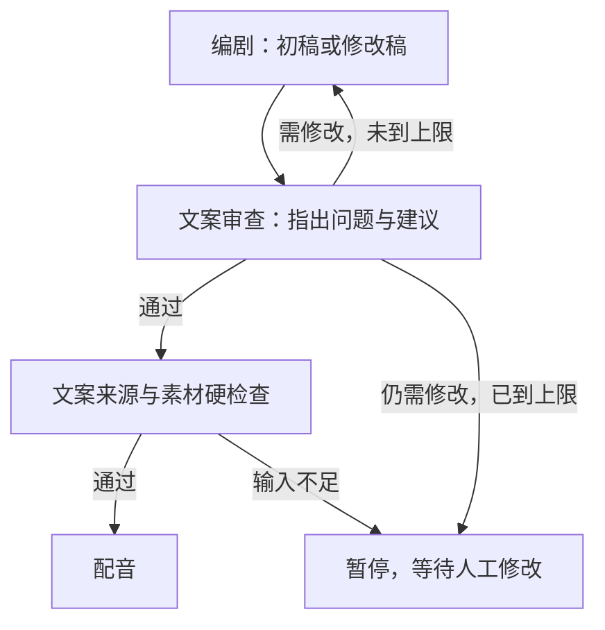

# 编剧与文案审查讨论

## 参考 TradingAgents 的实际机制

参考的是同级 `D:/TradingAgents-astock` 当前源码。`graph/setup.py` 创建和注册 Bull、Bear、Research Manager，Quality Gate 后进入 Bull。两个辩手分别把输出追加到 `investment_debate_state.history` 及自身历史，更新 `current_response` 和 `count`。下一位从共享 state 读取之前的发言，形成回应。

`graph/conditional_logic.py:70` 的 `should_continue_debate()` 在 `count >= 2 * max_debate_rounds` 时进入 Research Manager，否则根据最新发言的 Bull 前缀切换双方。默认最大轮数为 1，即 Bull → Bear → Manager；设为 2 才能让 Bull 回应 Bear。经理读取完整历史并输出结构化计划，原实现没有达成一致就提前结束的分支。

## 文案阶段的实现与边界

使用现有 `nodes/` 单层组织，保留编剧节点，增加 `ScriptReviewerNode`；两个角色可独立选择 Codex CLI / Claude Code CLI 和任意模型 ID。

本功能默认关闭，以便沿用已有配置。启用后默认最多 2 轮，范围 1–5；一次“编剧提交稿件 + 审查给出决定”为一轮。第二轮编剧必须进入 `rewrite()`，读取反馈、输出完整修改稿及回应，不使用“已有文案直接返回”的初稿缓存。审查可以提前通过；达到上限仍有问题时不会自动通过，也不增加第三个裁决模型。

审查关注事实与来源、逻辑、开头吸引力、口播清晰度、画面依据及用途；每项问题有段落 ID、问题和修改建议。通过时不能保留未解决问题。审查依据是来源快照和素材信息，最终人工视听审核仍负责核对实际截图、声音和成片。

## 设置与使用

1. 在系统设置开启“文案讨论”，设定最大审查轮数。
2. 分别启用并配置“编剧”和“文案审查”的 CLI、模型与超时。已有人工文案可以直接送审；需要自动改稿时必须启用编剧模型。
3. 保存设置后启动新制作。在文案工作区查看每轮完整稿件、审查问题、建议及编剧回应。
4. 达到上限仍未通过时，选择返工、编辑文案并保存新版本，再发起制作；修改后的版本重新讨论。暂停后单纯确认输入不会豁免仍未通过的审查。

轮数只限制本次文案讨论；模型调用仍受全局 `max_llm_calls` 预算约束。启用模型、修改设置、查看记录不会直接启动生成。讨论配置在每次执行首次进入编剧时冻结，修改全局开关或轮数只影响新的执行。

## 状态、产物与恢复

`Job.script_discussion` 与图中同名状态记录当前执行 ID、任务版本、开关、最大轮数、状态以及各轮稿件/回应/审查。状态为 DISABLED、DISCUSSING、APPROVED、EXHAUSTED；APPROVED 只表示本阶段文案审查通过。

讨论和当前文案以不可变 JSON 文件保存，记录 ID 由执行、版本及内容确定。SQL 已提交但 checkpoint 未提交时，节点优先读取同一执行的已保存轮次，防止重写或重复调用模型。节点仍执行任务版本、取消与 UNKNOWN 台账检查；切换模型不能绕过不确定提交。

编辑文案、导入素材或更改对齐形成新版本时清空旧讨论。自动改稿在同一次执行中保留任务版本，但清空旧分镜、审核及当前任务中的成片/预览/发布包等下游产物引用，避免旧视频被当成新稿的当前结果；原不可变文件仍保留。音频仍须通过全文实测对齐，讨论不能让旧音频适配新文案。

阅读入口：`nodes/screenwriter.py`、`nodes/script_reviewer.py`；共用保存与恢复在 `nodes/common.py`，连线在 `graph/video_graph.py`。

## 验证

2026-10-03：18 项讨论定向测试、1 项设置 API 测试通过，全量 244 Python、56 React 测试通过；Ruff、共享契约一致性、React typecheck/build 通过。独立审查 APPROVE，无遗留可行动问题。模型返回使用本地模拟，未发起真实 CLI 生成、配音或渲染；本机重启后设置接口及 API/worker 健康实测正常。
